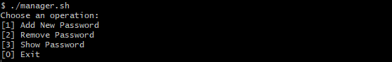

# Password Manager
This is a simple command-line password manager script written in Bash. The script allows you to add, remove, and show passwords securely using AES-256-CBC encryption. The passwords are stored in a hidden file named `.passwords`.

## Prerequisites
This script requires the `openssl` utility to be installed on your system.

## Installation
1. Clone the repository: `git clone https://github.com/TawanLekngam/Password-Manager.git`
2. Move into the directory: cd your-repository
3. Run the script: `./manager.sh`

## Usage
Upon running the script, you will be presented with a menu of options:

  

- To add a new password, select option 1 and enter the password and the associated website or account name. The password will be encrypted and stored in the `.passwords` file.

- To remove a password, select option 2 and enter the website or account name. The password will be removed from the `.passwords` file.

- To show a password, select option 3 and enter the website or account name. The encrypted password will be retrieved from the `.passwords` file, decrypted, and displayed on the screen.

## Security
The passwords are encrypted using AES-256-CBC encryption with PBKDF2 key derivation. The encryption key is derived from the user's input password, which is not stored or logged anywhere. The encrypted passwords are stored in a hidden file named `.passwords` in the same directory as the script.

## Disclaimer
This script is provided as-is and without any warranty or guarantee. Use at your own risk. The author is not responsible for any loss or damage caused by the use of this script.
